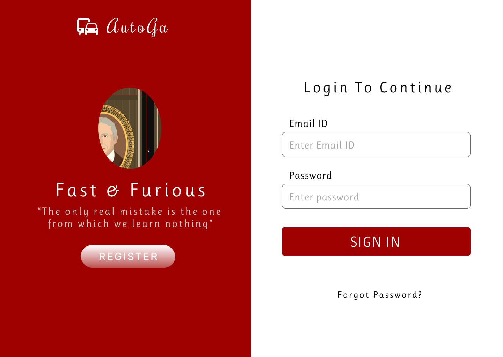
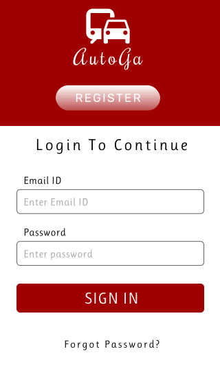
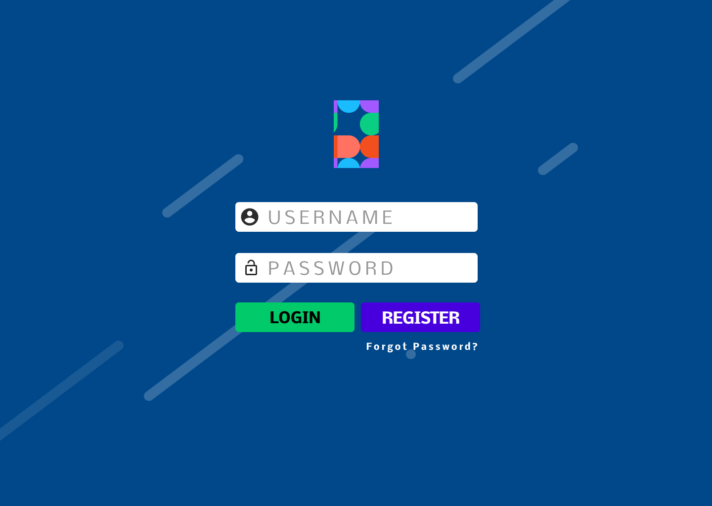
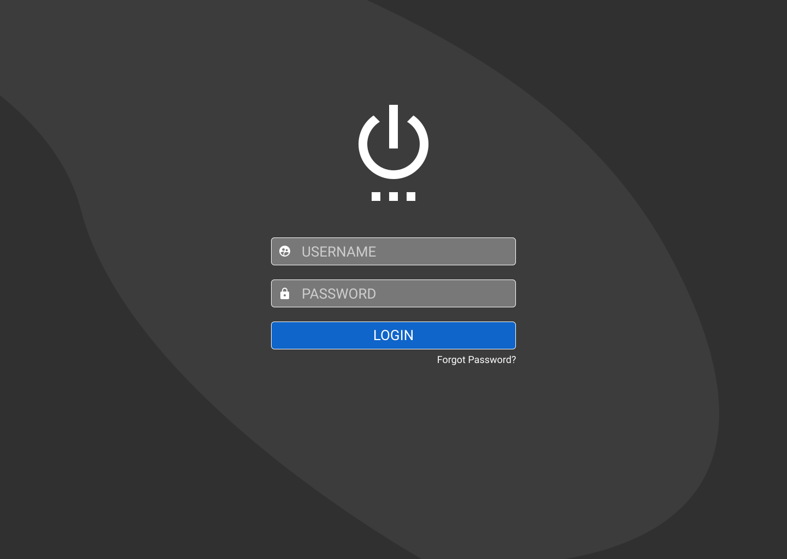
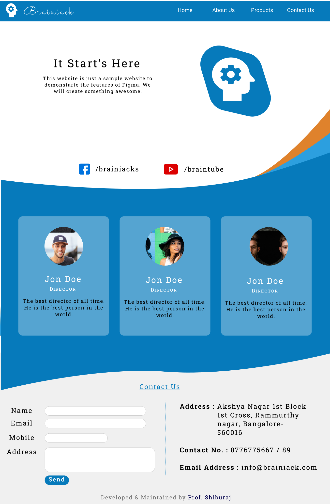
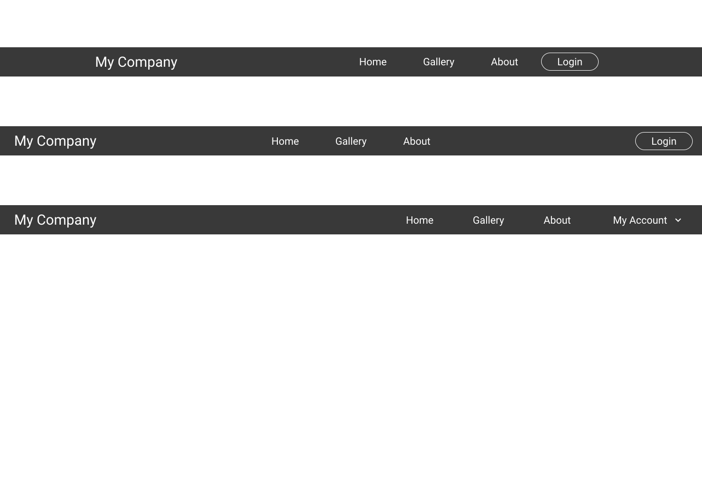
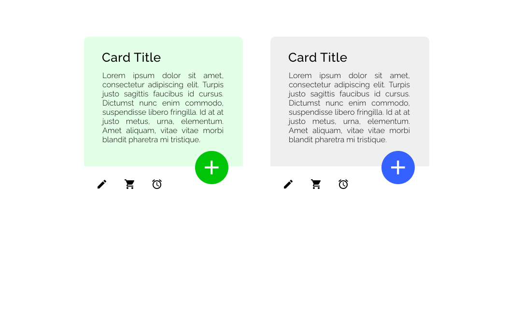
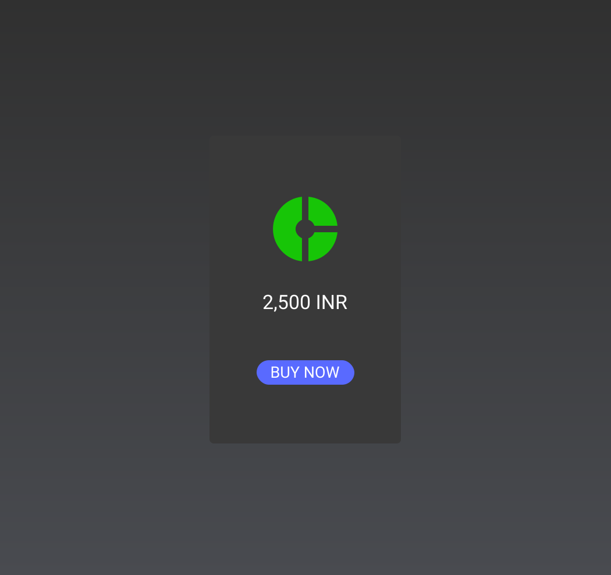

# My Figma Designs with HTML Source

## Pages
### Razor Gym ([Checkout the Page](https://softon.github.io/designs/razor_gym/))

### AutoGa ([Checkout the Page](https://softon.github.io/designs/autoga/))

### Figma Login ([Checkout the Page](https://softon.github.io/designs/figma_login/))

### Dark Login ([Checkout the Page](https://softon.github.io/designs/dark_login/))

### Brainiak ([Checkout the Page](https://softon.github.io/designs/brainiack/))

## Modules
### Navbars ([Checkout the Page](https://softon.github.io/modules/navbar.html))

### Light Card ([Checkout the Page](https://softon.github.io/modules/light_card.html))

### Dark Card ([Checkout the Page](https://softon.github.io/modules/dark_card.html))

